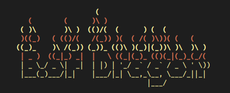
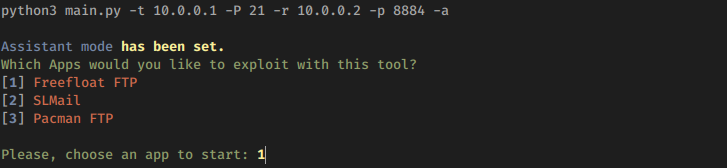

# BufferDragon
$ python3 main.py 

Dragon visa automatizar o processo de exploração de Buffer Overflow  

**Version:** *0.1.Alpha*

## To Do
* Create and set listener (For test, up yourself)
* Create agent class;
* Make agent send debugger info;
* Socket between Agent <> Server
* TBD

### Overflow some shitty apps like a fuck*ng dragon blowing fire

### Supported tools \[Just sample at all\]

### Developed by
[+] n3wpr 
### Suported by
[+] Th3_Pr0f3ss0r 
