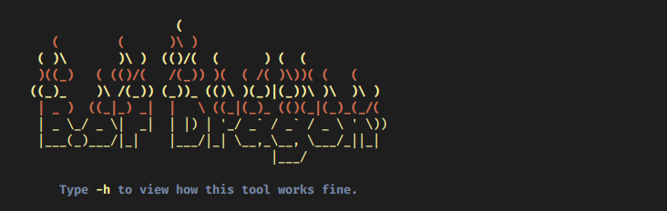

# BufferDragon
                       (                              
       (        (      )\ )                           
     ( )\       )\ )  (()/(  (      ) (  (            
     )((_)   ( (()/(   /(_)) )(  ( /( )\))( (   (     
    ((_)_    )\ /(_)) (_))_ (()\ )(_)|(_))\ )\  )\ )  
     | _ )  ((_|_) _|  |   \ ((_|(_)_ (()(_|(_)_(_/(  
     | _ \_/ _ \|  _|  | |) | '_/ _` / _` / _ \ ' \)) 
     |___(_)___/|_|    |___/|_| \__,_\__, \___/_||_|  
                                     |___/

Dragon visa automatizar o processo de exploração de Buffer Overflow  

**Version:** *0.1.Alpha*

## To Do
* Create and set listener (For test, up yourself)
* Create agent class;
* Make agent send debugger info;
* Socket between Agent <> Server
* TBD

### Overflow some shitty apps like a fuck*ng dragon blowing fire

### Developed by
[+] n3wpr 
### Suported by
[+] Th3_Pr0f3ss0r 
